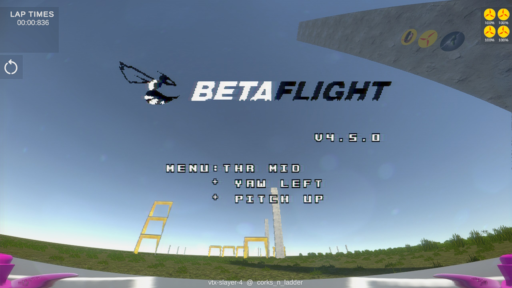

# SimITL - Sim In the Loop



[](https://www.gnu.org/licenses/gpl-3.0) 

SimITL is the successor to [KwadSimSITL](https://github.com/timower/KwadSimSITL) and a wrapper around [Betaflight](https://github.com/betaflight/betaflight)'s SITL ( software in the loop ) target to enable a realistic simulation of quadcopters running betaflight in a virtual environment. The main goal is to stay as close as possible to the real deal while maintaining a low latency which makes it possible to race virtually, using the actual betaflight code.

While SimITL is a virtual betaflight flight controller, it only outputs the quadcopter's orientation and speed, which can be used by any game engine to create a realistic betaflight simulator.

[pr0p](https://pr0p.dev/) is currently developed along with SimITL as a racing simulator.

# Betaflight

Uses betaflight `2025.12.0` pre release with small convenience changes and fixes

# Build
from a linux host (e.g. WSL) run:
```
./setup.sh
./build.sh
```
produces windows and linux binaries

# Example

See [simitl-tester](./tools/simitl-tester/README.md)